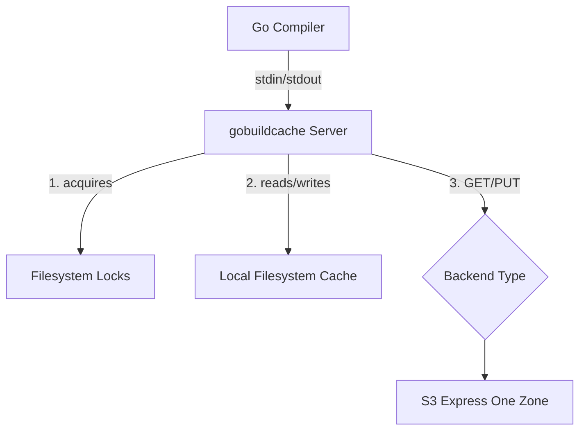
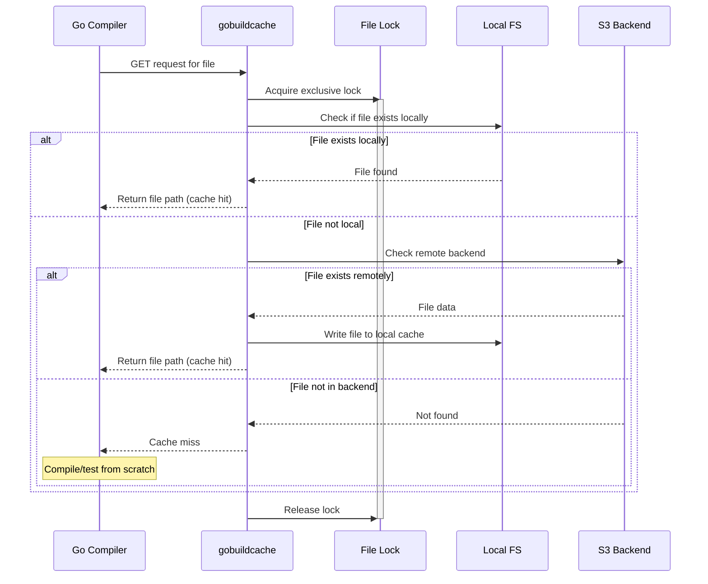
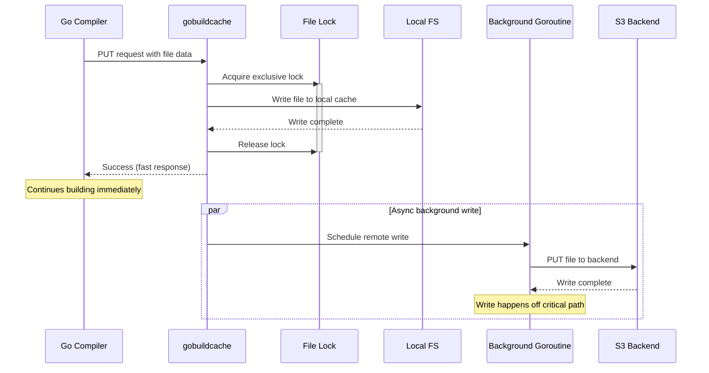

# Go Build Cache Server

TODO: Do we need to handle failed PUTs? I.E clean up if we fail to write and/or checksumming.
TODO: Rename to goremotecache.
TODO: Prefix for all environment variables

`gobuildcache` implements the [gocacheprog](https://pkg.go.dev/cmd/go/internal/cacheprog) interface defined by the Go compiler over a variety of storage backends, the most important of which is S3 Express One Zone (henceforth referred to as S3OZ). Its primary purpose is to accelerate CI (both compilation and tests) for large Go repositories. You can think of it as a self-hostable and O.S.S version of [Depot's remote cache feature](https://depot.dev/blog/go-remote-cache?utm_medium=kristen&utm_campaign=blog&utm_source=reddit&dub_id=cTRjiWqFlKwhwq4q).

Effectively, `gobuildcache` leverages S3OZ as a distributed build cache for concurrent `go build` or `go test` processes regardless of whether they're running on a single machine or distributed across a fleet of CI VMs. This dramatically improves the performance of CI for large Go repositories because every CI process will behave as if it is running with an almost completely pre-populated build cache, even if the CI process was started on a completely ephemeral VM that has never compiled code or executed tests for the repository before.

This is similar in spirit to the common pattern of restoring a shared go build cache at the beginning of the CI run, and then saving the freshly updated go build cache at the beginning of the CI run so it can be restored by subsequent CI jobs. However, the approach taken by `gobuildcache` is much more efficient resulting in dramatically lower CI times (and bills) with significantly less "CI engineering" required. For more details on why the approach taken by `gobuildcache` is better, see the "Why Should I Use gobuildcache" section.

`gobuildcache` is designed to use S3OZ as a remote / distributed cache, but it still writes build cache data to the local filesystem. There is no way to avoid this due to the nature of the `GOCACHEPROG` protocol implemented by the Go toolchain. As a result, CI runners using `gobuildcache` will still need some amount of ephemeral storage. Also, keep in mind that `gobuildcache` assumes ephemeral storage and does not ever GC or trim either the local filesystem cache. See the "Preventing Cache Bloat" section for more details on that.

# Quick Start

## Installation

```bash
go install github.com/richardartoul/gobuildcache@latest
```

## Usage

```bash
export GOCACHEPROG=gobuildcache
go build ./...
go test ./...
```

By default, `gobuildcache` uses an on-disk cache stored in your operating system's default temporary directory. This is useful testing and experimentation with `gobuildcache`, but provides no benefits over the Go compiler's built in cache which also stores cached data on locally on disk.

For "production" use-cases in CI, you'll want to configure `gobuildcache` to use S3 Express One Zone, or a similarly low latency distributed backend.

```bash
export BACKEND_TYPE=s3
export S3_BUCKET=$BUCKET_NAME
```

You'll also have to provide AWS credentials. `gobuildcache` embeds the AWS V2 S3 SDK so any method of providing credentials to that library will work, but the simplest is to us environment variables as demonstrated below.

```bash
export GOCACHEPROG=gobuildcache
export BACKEND_TYPE=s3
export S3_BUCKET=$BUCKET_NAME
export AWS_REGION=$BUCKE_REGION
export AWS_ACCESS_KEY_ID=$AWS_ACCESS_KEY
export AWS_SECRET_ACCESS_KEY=$AWS_SECRET_ACCESS_KEY
go build ./...
go test ./...
```

Your credentials must have the following permissions:

```json
{
  "Version": "2012-10-17",
  "Statement": [
    {
      "Effect": "Allow",
      "Action": [
        "s3:GetObject",
        "s3:PutObject",
        "s3:DeleteObject",
        "s3:ListBucket",
        "s3:HeadBucket",
        "s3:HeadObject"
      ],
      "Resource": [
        "arn:aws:s3:::$BUCKET_NAME",
        "arn:aws:s3:::$BUCKET_NAME/*"
      ]
    },
    {
      "Effect": "Allow",
      "Action": [
        "s3express:CreateSession"
      ],
      "Resource": [
        "arn:aws:s3express:$REGION:$ACCOUNT_ID:bucket/$BUCKET_NAME"
      ]
    }
  ]
}
```

## Github Actions Example

See the `examples` directory for examples of how to use `gobuildcache` in a Github Actions workflow. 

## S3 Lifecycle Policy

It's recommended to configure a lifecycle policy on your S3 bucket to automatically expire old cache entries and control storage costs. Build cache data is typically only useful for a limited time (e.g., a few days to a week), after which it's likely stale.

Here's a sample lifecycle policy that expires objects after 7 days and aborts incomplete multipart uploads after 24 hours:

```json
{
  "Rules": [
    {
      "Id": "ExpireOldCacheEntries",
      "Status": "Enabled",
      "Filter": {
        "Prefix": ""
      },
      "Expiration": {
        "Days": 7
      },
      "AbortIncompleteMultipartUpload": {
        "DaysAfterInitiation": 1
      }
    }
  ]
}
```

# Preventing Cache Bloat

`gobuildcache` performs zero automatic GC or trimming of the local filesystem cache or the remote cache backend. Therefore it is recommended that you run your CI on VMs with ephemeral storage and do not persist storage between CI runs. In addition, you should ensure that your remote cache backend has a lifecycle policy configured like the one described in the previous section.

That said, you can use the `gobuildcache` binary to clear the local filesystem cache and remote cache backends by running the following commands:

```bash
gobuildcache clear-local
```

```bash
gobuildcache clear-remote
```

The clear commands take the same flags / environment variables as the regular `gobuildcache` tool, so for example you can provide the `cache-dir` flag or `CACHE_DIR` environment variable to the `clear-local` command and the `s3-bucket` flag or `S3_BUCKET` environment variable to the `clear-remote` command.

# Configuration

`gobuildcache` ships with reasonable defaults, but this section provides a complete overview of flags / environment variables that can be used to override behavior.

| Flag | Environment Variable | Default | Description |
|------|---------------------|---------|-------------|
| `-backend` | `BACKEND_TYPE` | `disk` | Backend type: `disk` or `s3` |
| `-lock-type` | `LOCK_TYPE` | `fslock` | Mechanism for locking: `fslock` (filesystem) or `memory` |
| `-cache-dir` | `CACHE_DIR` | `/$OS_TMP/gobuildcache/locks` | Local cache directory |
| `-lock-dir` | `LOCK_DIR` | `/$OS_TMP/gobuildcache/cache` | Local directory for storing filesystem locks |
| `-s3-bucket` | `S3_BUCKET` | (none) | S3 bucket name (required for S3) |
| `-s3-prefix` | `S3_PREFIX` | (empty) | S3 key prefix |
| `-debug` | `DEBUG` | `false` | Enable debug logging |
| `-stats` | `PRINT_STATS` | `false` | Print cache statistics on exit |


# How it Works

`gobuildcache` runs a server that processes commands from the Go compiler over stdin and writes results over stdout. Ultimately, `GET` and `PUT` commands are processed by remote backends like S3OZ, but first they're proxied through the local filesystem.

## Architecture Overview



## Processing `GET` commands

When `gobuildcache` receives a `GET` command, it checks if the requested filed is already stored locally on disk. If file already exists locally, it returns the path of the cached file so that the Go compiler can use it immediately. If the file is not present locally, it consults the configured "backend" to see if the file is cached remotely. If it is, it loads the file from the remote backend, writes it to the local filesystem, and then returns the path of the cached file. If the file is not present in the remote backend, it returns a cache miss and the Go toolchain will compile the file or execute the test.



## Processing `PUT` commands

When `gobuildcache` receives a `PUT` command, it writes the provided file to its local on-disk cache. Separately, it schedules a background goroutine to write the file to the remote backend. It writes to the remote backend outside of the critical path to avoid the latency of S3OZ writes from blocking the Go toolchain from making fruther progress in the meantime.



## Locking

`gobuildcache` uses exclusive filesystem locks to fence `GET` and `PUT` operations for the same file such that only one operation can run concurrently for any given file (operations across different files can proceed concurrently). This ensures that the filesystem does not get corrupted by trying to write the same file path concurrently if concurrent PUTs are received for the same file, it also prevents `GET` operations from seeing torn/partial writes from failed or in-flight `PUT` operations. Finally, it deduplicates `GET` operations against the remote backend which saves resources, money, and bandwidth.

# Why should I use gobuildcache?

First, the local on-disk cache of the CI VM doesn't have to be pre-populated at once. `gobuildcache` populates it by loading the cache on the fly as the Go compiler compiles code and runs test. This makes it so you don't have to waste several precious minutes of CI time waiting for gigabytes of data to be downloaded and decompressed while CI cores sit idle. This is why S3OZ's low latency is crucial to `gobuildcache`'s design.

Second, `gobuildcache` is never stale. A big problem with the common caching pattern described above is that if the P.R under test differs "significantly" from the main branch (say, because a package that many other packages depend on has been modified) then the Go toolchain will be required to compile almost every file from scratch, as well as run almost every test in the repo. Contrast that with the `gobuildcache` approach where the first commit that is pushed will incur the penalty described above, but all subsequent commits will experience extremely high cache hit ratios. One way to think about this benefit is that with the common approach, only one "branch" of the repository can be cached at any given time (usually the `main` branch), and as a result all P.Rs experience CI delays that are roughly proportional to how much they "differ" from `main`. With the `gobuildcache` approach, the cache stored in S3OZ can store a hot cache for all of the different branches and PRs in the repository at the same time. This makes cache misses significantly less likely, and reduces average CI times dramatically.

Third, the `gobuildcache` approach completely obviates the need to determine how frequently to "rebuild" the shared cache tarball. This is important, because rebuilding the shared cache is expensive as it usually has to be built from a CI process running with no pre-built cache to avoid infinite cache bloat, but if its run too infrequently then CI for PRs will be slow (because they "differ" too much from the stale cached tarball).

Fourth, `gobuildcache` makes parallelizing CI using commonly supported "matrix" strategies much easier and efficient. For example, consider the common pattern where unit tests are split across 4 concurrent CI jobs using Github actions matrix functionality. In this approach, each CI job runs ~ 1/4th of the unit tests in the repostitory and each CI job determines which tests its responsible for running by hashing the unit tests name and then moduloing it by the index assigned to the CI job by Github actions matrix functionality. This works great for parallelizing test execution across multiple VMs, but it presesents a huge problem for build caching. The Go build cache doesn't just cache package compilation, it also cache test execution. This is a hugely important optimization for CI because it means that if you can populate the the CI job's build cache efficiently, P.Rs that modify packages that not many other packages depend on will only have to run a small fraction of the total tests in the repository. However, generating this cache is difficult now because each CI job is only executing a fraction of the test suite, so the build cache generated by CI job 1 will result in 0 cache hits for job 2 and vice versa. As a result, CI job matrix unit now has to restore and save a build cache that is unique to its specific matrix index. This is doable, but it's annoying and requires solving a bunch of other incidental engineering challenges like making sure the cache is only ever saved from CI jobs running on the main branch, and using consistent hashing instead of modulo hashing to assign tests to CI job matrix units (because otherwise add a single test will completely shuffle the assignment of tests to CI jobs and the cache hit ratio will be terrible). All of these problems just dissapear when using the `gobuildcache` because the CI jobs behave much more like stateless, ephemeral compute while still benefitting from extremely high cache hit ratios due to the shared / distributed cache backend.

# Can I use regular S3?

Yes, but the latency of regular S3 is 10-20x higher than S3OZ which undermines the approach taken by `gobuildcache`. For some workloads you'll still see an improvement over not using `gobuildcache` at all, but for some other workloads CI performance will actually get worse. I highly recommend using S3 Express One Zone instead.


### CI/CD Pipeline with S3

```yaml
# Example GitHub Actions workflow
env:
  # Use environment variables for cleaner configuration
  BACKEND_TYPE: s3
  S3_BUCKET: ci-build-cache
  S3_PREFIX: ${{ github.repository }}/
  AWS_REGION: us-east-1
  GOCACHEPROG: gobuildcache

steps:
  - name: Download cache server
    run: |
      curl -L -o gobuildcache https://example.com/gobuildcache
      chmod +x gobuildcache
  
  - name: Configure AWS credentials
    uses: aws-actions/configure-aws-credentials@v4
    with:
      role-to-assume: arn:aws:iam::123456789012:role/GithubActionsRole
      aws-region: us-east-1
  
  - name: Build with remote cache
    run: go build ./...
```
